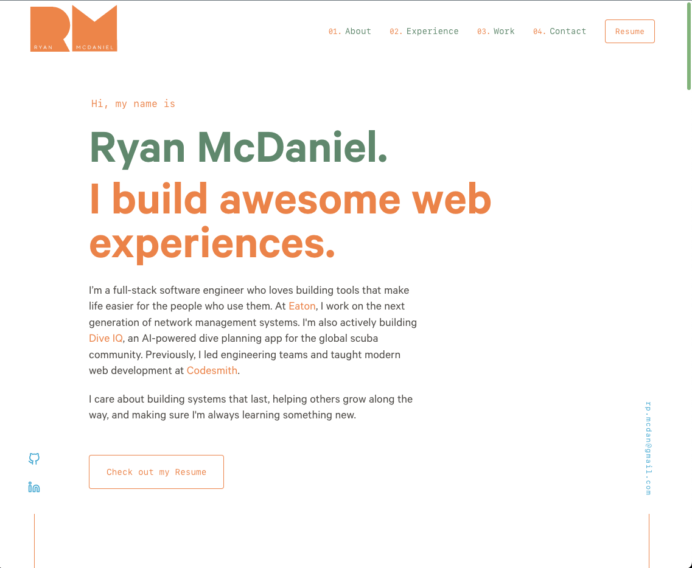

# ryanmcdaniel.io – Portfolio v1

Source code for my portfolio site, built with **Gatsby** and deployed on **Vercel**. It showcases featured projects, technologies I’ve worked with, and my engineering experience.

---

## Tech Stack

- Gatsby
- React
- GraphQL
- Sass / Styled Components
- Vercel (CI/CD + hosting)

---

## Features

- Responsive design for desktop & mobile
- Smooth section navigation + hover animations
- Project cards with logos and external links
- CI/CD pipeline with Vercel for automatic deploys
- Clean typography and color palette aligned with my personal branding (and inspired by my favorite color combo!)

---

## Demo

🔗 [View the live site](https://ryanmcdaniel.io)

---

## Credits

Inspired by [Brittany Chiang](https://brittanychiang.com/)’s awesome open source portfolio, and since rebuilt and customized into my own iteration.
